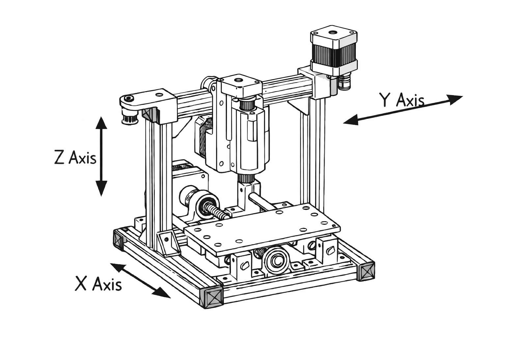
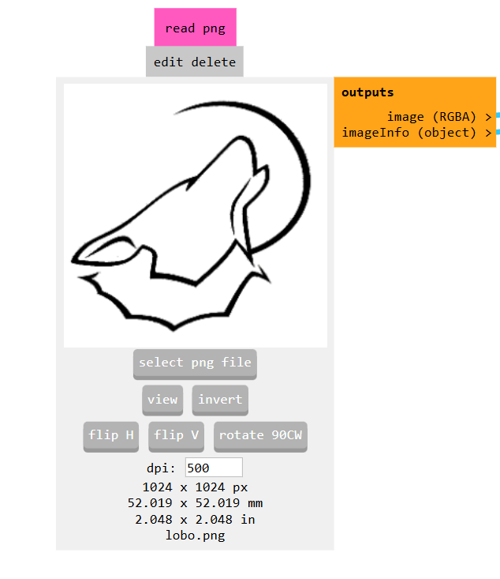
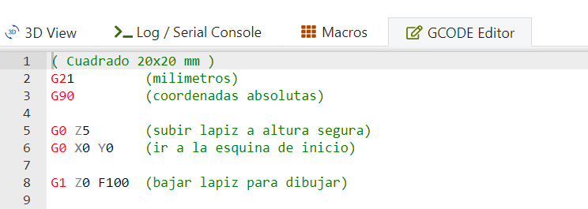
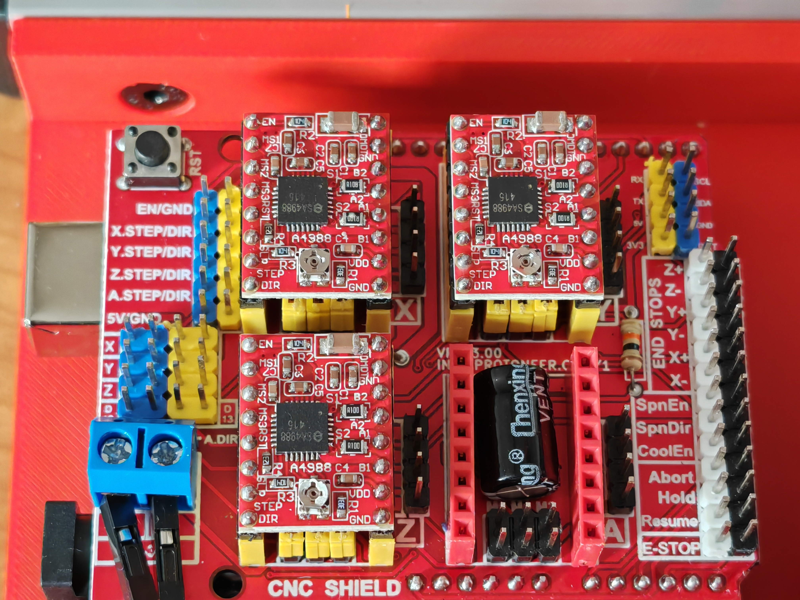
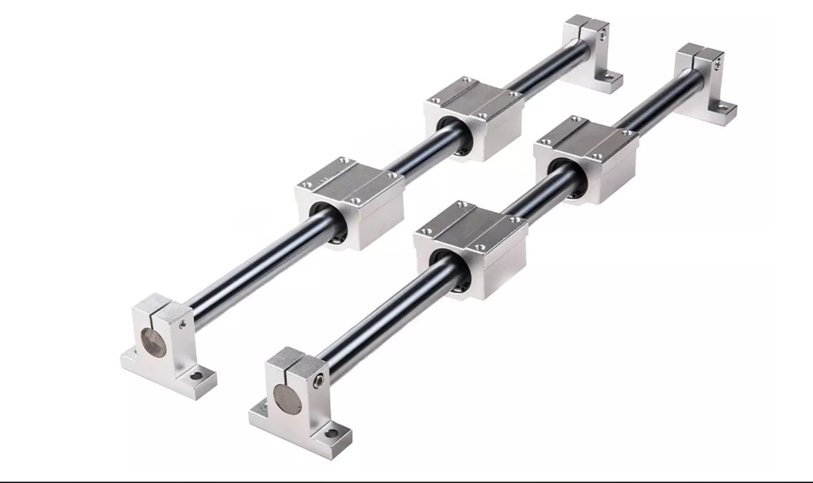
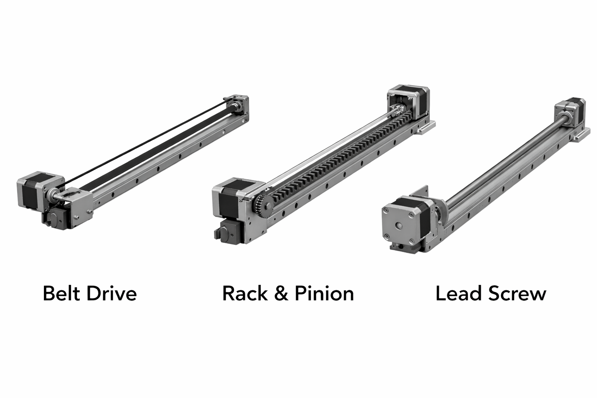
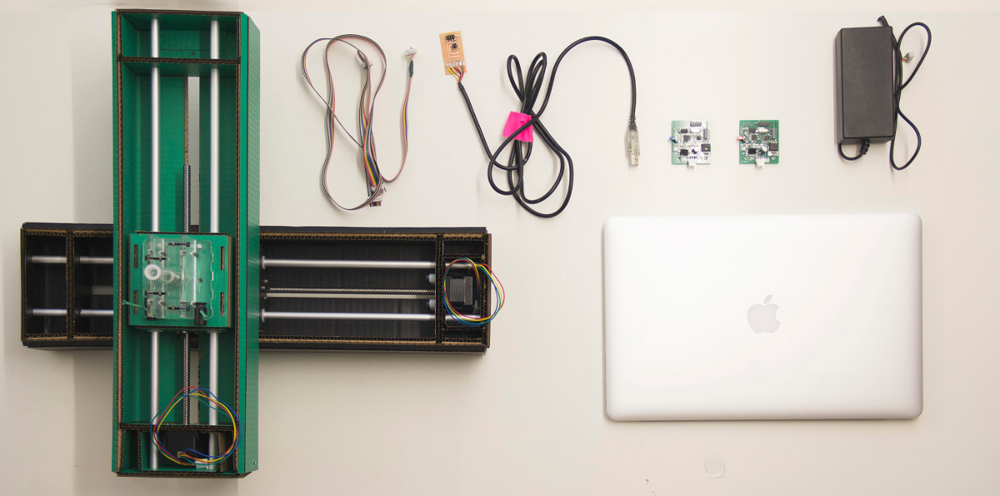
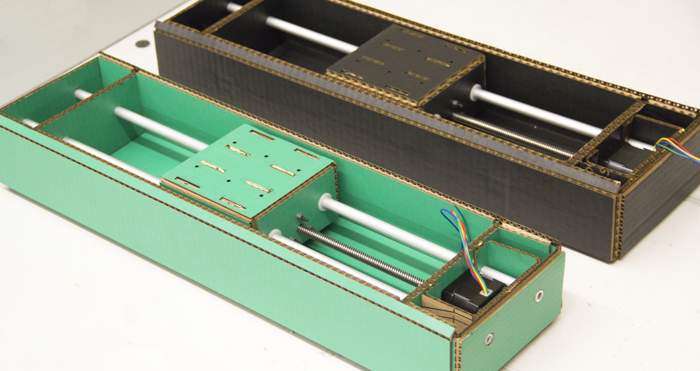
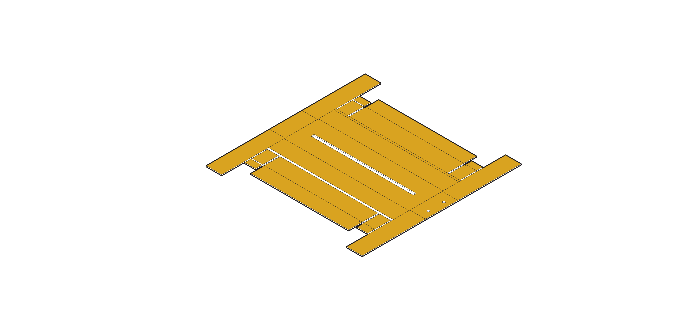
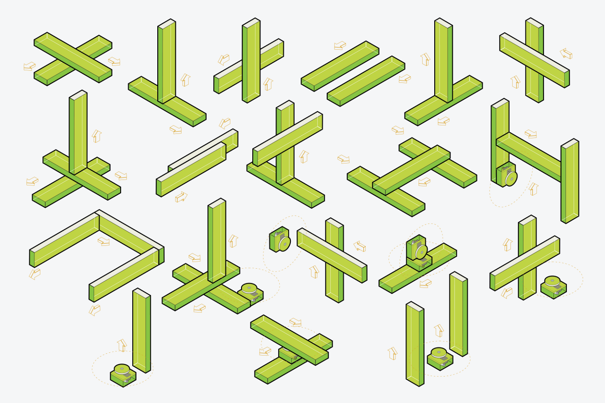

# Arquitectura general de una CNC

Una máquina **CNC** (*Computer Numerical Control*) es un sistema capaz de ejecutar movimientos controlados a partir de instrucciones numéricas. En lugar de mover manualmente una herramienta, el operador define una geometría, genera trayectorias y la máquina convierte esa información en desplazamientos coordinados sobre sus ejes [1], [2].

## 1. Flujo de trabajo al utilizar una CNC

De forma general, el flujo de trabajo de una CNC puede descomponerse en los siguientes pasos:

### 1.1 Diseño digital

Diseño por computadora de la pieza, contorno o trayectoria en un entorno CAD o a partir de un flujo 2D/3D. Después, un software CAM o una herramienta intermedia convierte esa geometría en trayectorias y parámetros de proceso.

### 1.2 Programa en lenguaje máquina

El resultado suele expresarse como **G-code**, un conjunto de instrucciones que indican coordenadas, velocidades, movimientos, arranques, pausas y otras acciones necesarias para ejecutar el trabajo [2].

### 1.3 Controlador y etapa de potencia

El controlador interpreta ese programa y lo traduce en señales temporizadas para cada eje. En esta máquina, ese papel lo realiza **GRBL** corriendo sobre un **Arduino UNO**, junto con la lógica de interfaz proporcionada por el **CNC Shield**.

Los **drivers** convierten las señales de bajo nivel del controlador en corriente adecuada para mover los motores paso a paso. Aquí aparece el puente entre lógica y potencia.

### 1.4 Sistema mecánico

Finalmente, la parte mecánica transforma la rotación de los motores en desplazamiento lineal. Aquí intervienen la estructura, las guías, los carros, los soportes y los mecanismos de transmisión.

## 2. Ejes, estructura y movimiento

En una CNC cartesiana, los movimientos se organizan normalmente sobre los ejes **X, Y y Z**. Cada eje debe cumplir dos funciones al mismo tiempo:

- **Componentes de guiado**, que obligan al carro a desplazarse recto, restringiendo los grados de libertad no deseados.

- **Componentes de transmisión**, permitiendo movimiento en una sola dirección útil, empujando o arrastrando la carga.

Esta distinción es importante: una guía lineal no reemplaza una banda, un husillo o una cremallera; cada elemento resuelve una función distinta.

## 3. La CNC como sistema modular

Para documentar y diseñar mejor una máquina de este tipo, conviene pensarla como un conjunto de módulos:

- Estructura
- Guías
- Transmisión
- Motores
- Módulo de control 
- Software de control
- Herramienta

Este enfoque se relaciona bien con la filosofía de **Machines That Make (MTM)** del MIT Center for Bits and Atoms, donde se trabaja con máquinas, componentes y subconjuntos reconfigurables que permiten prototipar rápidamente nuevas configuraciones y evolucionarlas por iteraciones [3], [4].

La modularidad permite:

- Facilita rediseñar un eje sin rehacer toda la máquina;
- Escalar la máquina cambiando solo la longitud de perfiles y ejes;
- Permite probar varias soluciones de transmisión;
- Cambiar el cabezal o herramienta;
- Ayuda a sustituir piezas impresas, comerciales o estructurales;
- Vuelve más replicable el sistema.
- Separar claramente la parte mecánica de la parte electrónica;

## 5. MTM en FabAcademy
<video controls width="640">
  <source src="{{ 'https://ng.cba.mit.edu/show/video/15.10.cardboard.mp4' | relative_url }}" type="video/mp4">
  Tu navegador no soporta video HTML5.
</video>

## Referencias

[1] Haas Automation, *Mill Programming Workbook*. Oxnard, CA, USA: Haas Automation. [En línea]. Disponible en: https://www.haascnc.com/content/dam/haascnc/en/service/reference/programming-workbooks/mill---programming-workbook.pdf

[2] Haas Automation, *Lathe Programming Workbook*. Oxnard, CA, USA: Haas Automation. [En línea]. Disponible en: https://www.haascnc.com/content/dam/haascnc/en/service/reference/programming-workbooks/lathe---programming-workbook.pdf

[3] MIT Center for Bits and Atoms, “Machines That Make,” 2026. [En línea]. Disponible en: https://mtm.cba.mit.edu/

[4] MIT Center for Bits and Atoms, “Cardboard Stages,” 2014. [En línea]. Disponible en: https://mtm.cba.mit.edu/2014/2014_mmtm/

---

## Siguiente sección

[Motores y mecanismos de transmisión](motores-y-mecanismos.md)
