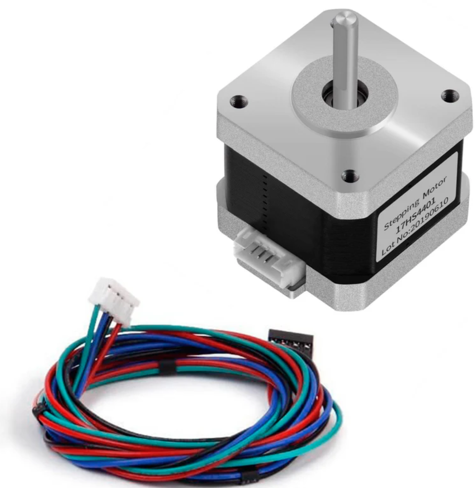
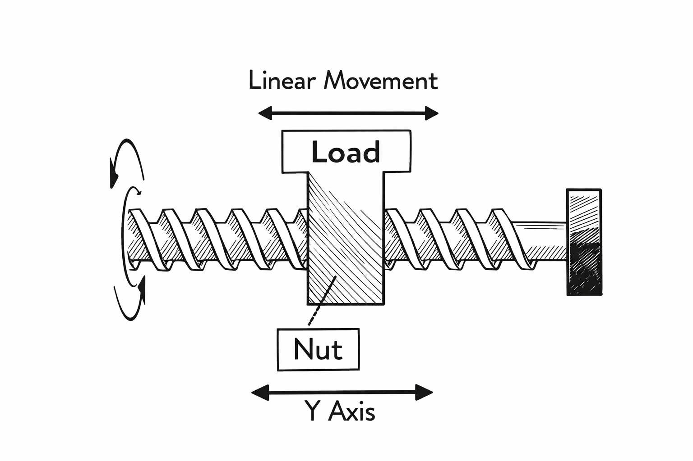
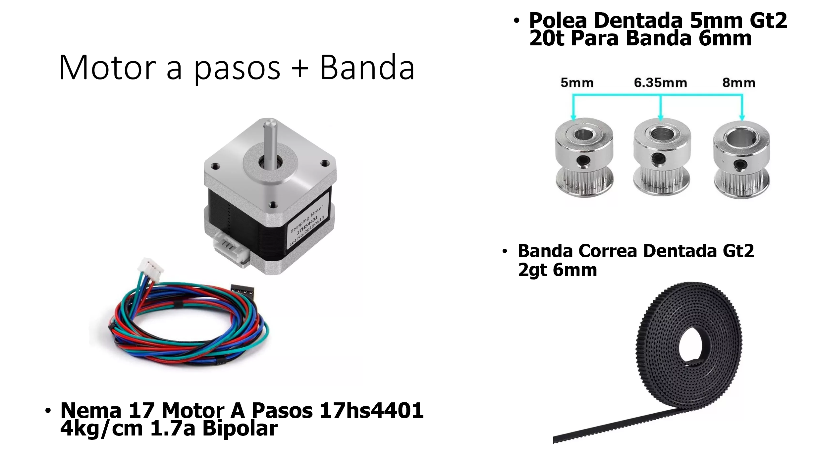
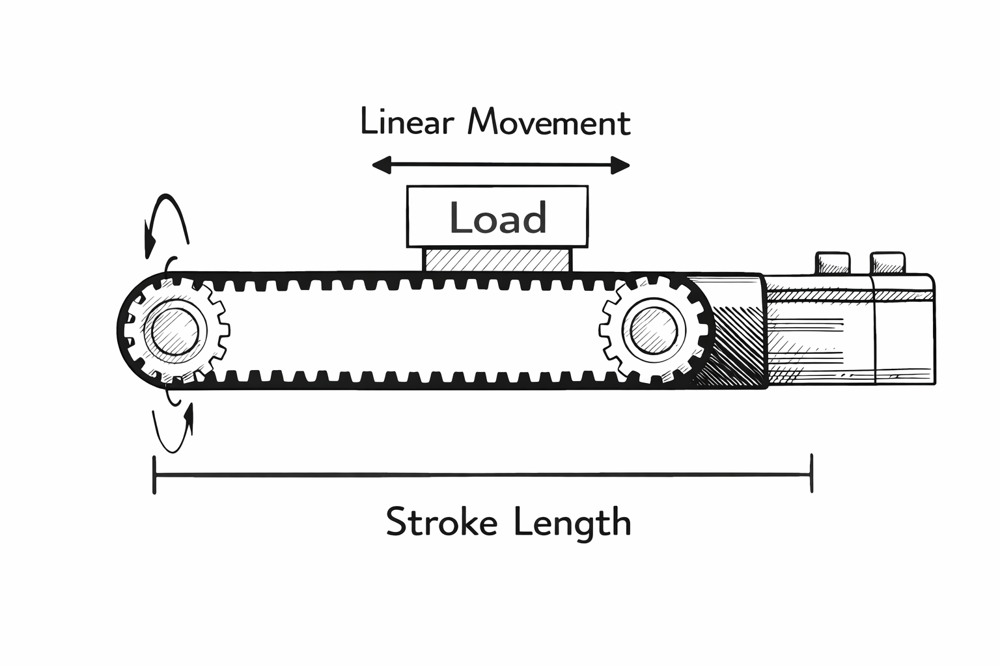
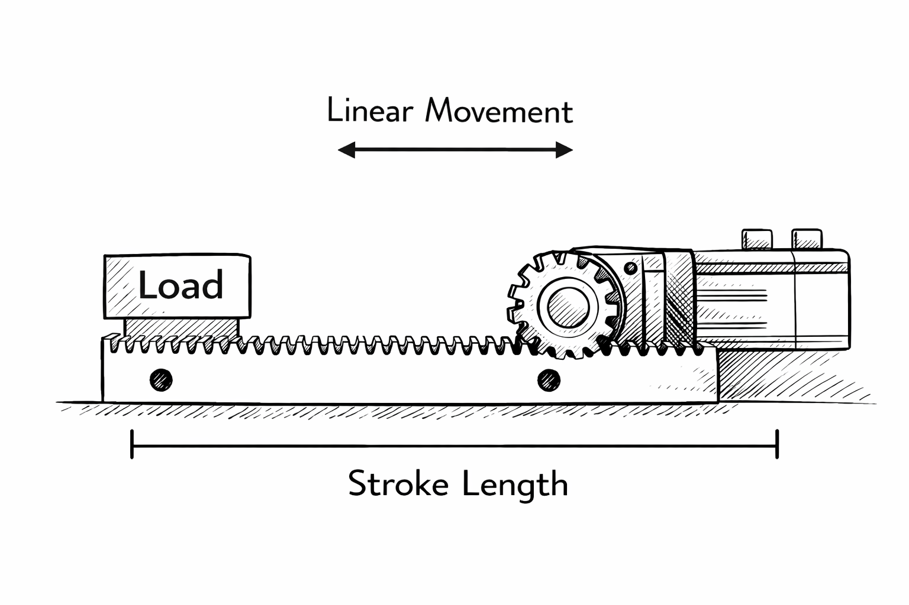
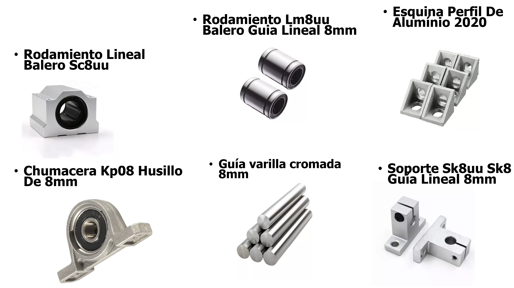
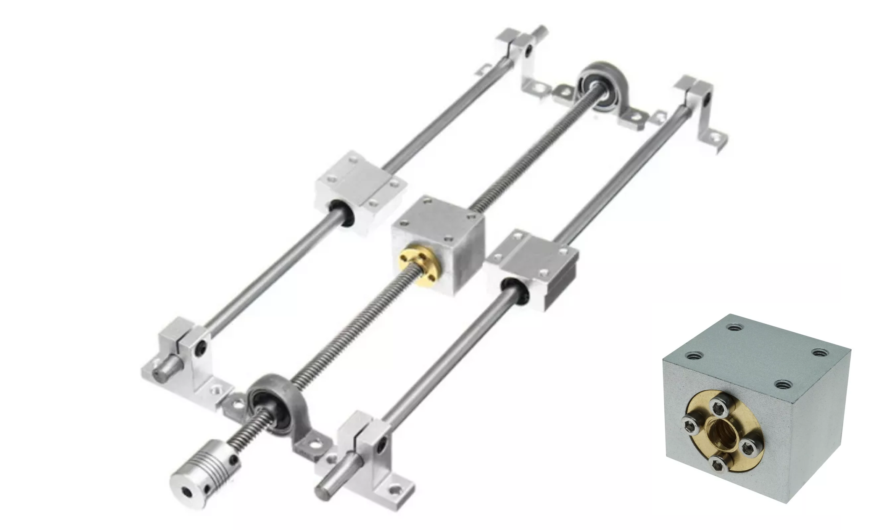

# Motores y mecanismos de transmisión

Una CNC necesita convertir el movimiento rotativo del motor en **movimiento lineal controlado**. Esa conversión puede lograrse con distintos mecanismos, y la elección del mecanismo afecta directamente la velocidad, el empuje, la rigidez, la precisión, la longitud de recorrido y el costo del eje [1], [2].

<iframe width="560" height="315"
  src="https://www.youtube.com/embed/OAEwRMqpst0"
  title="Video sobre motores y mecanismos CNC"
  frameborder="0"
  allow="accelerometer; autoplay; clipboard-write; encrypted-media; gyroscope; picture-in-picture; web-share"
  allowfullscreen>
</iframe>

En esta sección se comparan tres mecanismos muy comunes en máquinas CNC y automatización ligera:

- **Husillo**,
- **Banda dentada**,
- **Engrane-cremallera**.

También se aclara el papel de las **guías lineales**, ya que con frecuencia se confunden con la transmisión aunque cumplen otra función.

## 1. El motor no define solo el eje

En máquinas didácticas y de prototipado es muy común usar **motores a pasos**. Estos motores son adecuados porque permiten construir sistemas relativamente simples, económicos y suficientemente precisos para muchas aplicaciones de posicionamiento.

Sin embargo, el comportamiento real del eje no depende solamente del motor. En términos de ingeniería, el desempeño aparece por la combinación de:motor,transmisión,guiado, masa móvil, rigidez estructural, estrategia de control.

## 2. Husillo

El sistema por **husillo** convierte la rotación en avance lineal mediante un tornillo y una tuerca. En la práctica pueden encontrarse variantes como **lead screw**, **Acme** y **ball screw**. Cada vuelta del eje produce un avance lineal determinado por el paso o el lead del tornillo [1].

### Ventajas típicas del husillo

- Buen empuje axial,
- Buena relación entre rotación y avance,
- Buena rigidez para recorridos cortos o medianos,
- Buena solución cuando importa más el control del avance que la velocidad máxima.

### Limitaciones típicas del husillo

- Menor velocidad que una banda en recorridos largos,
- Restricciones por velocidad crítica en tornillos largos,
- Mayor sensibilidad a desalineación,
- Menor conveniencia cuando el recorrido crece mucho.

En general, el husillo suele ser una solución atractiva cuando se busca mayor capacidad de carga, mejor control del avance o una respuesta más rígida que la de una banda [1], [3].

## 3. Banda dentada

En un sistema por **banda dentada**, el motor mueve una polea y la polea arrastra una banda sincronizada que desplaza el carro. Es una solución muy común en ejes largos y ligeros porque es simple, rápida y fácil de integrar [1].

### Ventajas típicas de la banda

- Alta velocidad,
- Buena aceleración,
- Buena solución para recorridos largos,
- Menor masa rotacional que un husillo largo,
- Costo relativamente accesible.

### Limitaciones típicas de la banda

- Menor rigidez que un husillo o algunas soluciones por cremallera,
- Sensibilidad a la tensión de banda,
- Posibilidad de elongación o elasticidad del sistema,
- Menor empuje axial disponible.

Por eso la banda dentada es muy común en routers ligeros, plotters, cortadoras y mecanismos donde interesa más la dinámica del eje que el empuje máximo [1], [2].

## 4. Piñon-cremallera

El sistema de **piñon-cremallera** usa un piñón rotativo acoplado a una barra dentada lineal. Esta solución es muy utilizada cuando el recorrido se vuelve demasiado largo para que el husillo sea conveniente o cuando se requieren ejes largos, dinámicos y robustos [2], [4].

### Ventajas típicas de la cremallera

- Buena solución para largos recorridos,
- Buena rigidez estructural del sistema,
- Buen desempeño dinámico,
- Posibilidad de sistemas precargados para reducir backlash.

### Limitaciones típicas de la cremallera

- Mayor complejidad mecánica,
- Necesidad de buena alineación,
- Atención al backlash si no se precarga,
- Mayor costo que soluciones simples de banda en máquinas ligeras.

En aplicaciones industriales, la cremallera se vuelve muy competitiva cuando la longitud del eje es alta y la máquina necesita conservar rigidez y repetibilidad [4].

## 5. Las guías lineales no son la transmisión

Un punto fundamental: las **guías lineales** no generan el movimiento, sino que **restringen** el movimiento a una trayectoria recta. THK describe este tipo de elementos como componentes lineales que usan principios de rodamientos para mover objetos en línea recta con baja fricción y buena capacidad de carga [5].

Eso significa que un eje lineal completo normalmente tiene al menos dos subsistemas:

- un sistema de **guiado**,
- un sistema de **accionamiento**.

Por ejemplo:

- guía lineal + husillo,
- varilla lisa + bloque lineal + banda,
- riel + carro + cremallera.

## 6. Comparación rápida

| Mecanismo | Punto fuerte principal | Limitación típica | Uso común |
|---|---|---|---|
| Husillo | Empuje y control del avance | Menor velocidad en recorridos largos | Z, ejes cortos o de mayor rigidez |
| Banda dentada | Velocidad y aceleración | Menor rigidez / elasticidad | X o Y en máquinas ligeras |
| Engrane-cremallera | Recorrido largo y rigidez | Mayor complejidad y costo | Gantries medianos o grandes |

## 7. Criterio práctico de selección

Una forma útil de seleccionar el mecanismo es hacerte estas preguntas:

- ¿Qué tan largo será el eje?
- ¿Qué masa se moverá?
- ¿Qué tan importante es la velocidad?
- ¿Qué tan importante es la fuerza axial?
- ¿Qué tan importante es la rigidez?
- ¿La máquina va a dibujar, cortar, grabar o fresar material con esfuerzo real?

## Referencias

[1] Tolomatic, “Screw-driven vs. belt-driven rodless actuators: How to select drive trains for reliability, efficiency and long service life,” 2026. [En línea]. Disponible en: https://www.tolomatic.com/info-center/resource-details/screw-vs-belt-rodless-actuators-selecting-drive-trains/

[2] Tecnotion, “Comparison of linear motors and other drive systems,” 2026. [En línea]. Disponible en: https://www.tecnotion.com/comparison-of-linear-motors-and-other-drive-systems/

[3] Tolomatic, *Screw-Driven vs. Belt-Driven Rodless Actuators*, PDF técnico. [En línea]. Disponible en: https://www.tolomatic.com/wp-content/uploads/2022/05/9900-9210_screw-vs-belt-actuators-2021.pdf

[4] Nidec Drive Technology Corporation, “Applying Rack and Pinion in Linear Drive Systems,” 2026. [En línea]. Disponible en: https://www.nidec-dtc.com/applying-rack-and-pinion-in-linear-drive-systems/

[5] THK Co., Ltd., “Linear Guides (Linear Motion Guides) Design and Selection,” 2026. [En línea]. Disponible en: https://www.thk.com/opm/jp/en/linear/thklinearguide/
