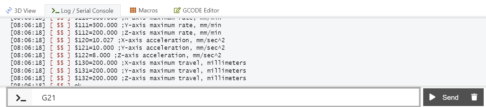
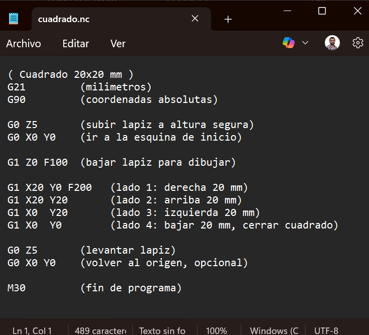
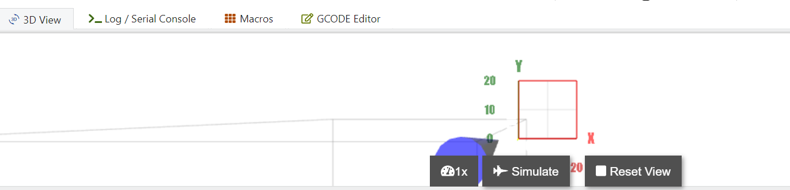
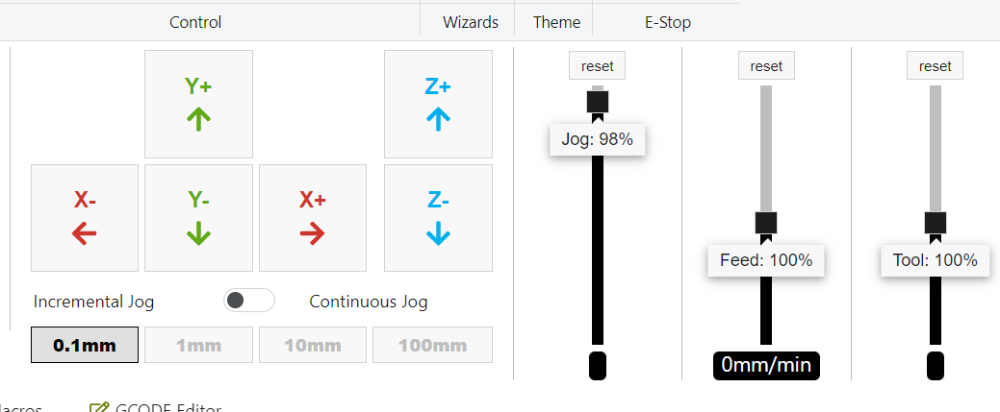

# Crear tu primer archivo G-code (.nc)

En esta sección vamos a crear, paso a paso, tu **primer programa en G-code** para que la CNC dibuje o mecanice un **cuadrado simple**.

- Usaremos solo **comandos básicos**.
- Guardaremos el archivo con extensión **`.nc`**.
- Lo cargaremos después en **OpenBuilds CONTROL** para ejecutarlo.

> 💡 La idea es que, una vez que entiendas este ejemplo, puedas modificarlo para hacer rectángulos, marcos, patrones simples, etc., incluso sin usar todavía FabModules o un software CAM más avanzado.

---

## 1. Comandos G básicos para pruebas

Antes de construir el programa completo, vale la pena ver algunos **comandos básicos** que usaremos en el G-code. Todos estos se pueden probar primero directamente en la **consola de OpenBuilds CONTROL**.



### 1.1. Cambio de unidades y modos

```gcode
G21      ; usar milímetros
G20      ; usar pulgadas

G90      ; modo absoluto (coordenadas desde el origen)
G91      ; modo incremental (movimientos relativos)
```

- `G21` / `G20` definen si los movimientos se interpretan en **mm** o en **pulgadas**.
- `G90` → todas las coordenadas serán absolutas respecto al origen actual (X0, Y0, Z0).
- `G91` → los movimientos son **relativos** (incrementales) a la posición actual.

En este manual trabajaremos casi siempre con:

```gcode
G21
G90
```

### 1.2. Movimientos rápidos y de trabajo

```gcode
G0 X0 Y0 Z5      ; movimiento rápido (rapids) a la posición indicada
G1 X10 F200      ; movimiento lineal a X=10 mm con avance 200 mm/min
G1 Y10           ; movimiento lineal a Y=10 mm (mantiene F anterior)
G1 X0 Y0         ; regreso al origen en XY
```

- `G0` → movimiento rápido (sin controlar el avance de corte, solo para posicionamiento).
- `G1` → movimiento lineal **con avance controlado** (F en mm/min).

### 1.3. Ejemplo: pequeño rectángulo de prueba

Antes del cuadrado “formal”, puedes probar este mini-ejemplo:

```gcode
G21 G90           ; mm y modo absoluto
G0 X0 Y0 Z5       ; ir rápido al origen, levantar Z
G1 Z0 F100        ; bajar Z (acercar herramienta)
G1 X20 F200       ; trazar 20 mm en X
G1 Y10            ; trazar 10 mm en Y
G1 X0             ; volver a X=0
G1 Y0             ; volver a Y=0
G0 Z5             ; levantar Z
```


Este ejemplo se parece mucho a lo que haremos con el cuadrado, pero todavía no está organizado como archivo `.nc` completo.

---

## 2. ¿Qué es un archivo G-code?

Un archivo G-code es simplemente un **archivo de texto plano** que contiene:

- Líneas con **comandos G y M** (movimientos, encendido/apagado, etc.).
- Comentarios (opcionales) para documentar qué hace cada parte.
- Normalmente se guarda con extensiones como `.nc`, `.gcode`, `.tap`, etc.

Puedes editarlo con:

- **Bloc de notas / Notepad**
- **Visual Studio Code**
- Cualquier editor de texto simple (no Word).



---

## 3. Estructura mínima de un programa G-code

Un programa típico incluye:

1. **Selección de unidades y modo**:
   - `G21` → milímetros
   - `G90` → coordenadas absolutas

2. **Posicionamiento seguro**:
   - Levantar Z a una altura segura.
   - Ir rápido al punto inicial.

3. **Movimiento de trabajo**:
   - Bajar Z a la profundidad de trabajo.
   - Trazar la trayectoria (en este caso, un cuadrado).

4. **Final del programa**:
   - Levantar Z.
   - Volver a una posición segura (opcional).
   - Comando de fin (`M30`).

Ejemplo de encabezado genérico:

```gcode
(Programa de prueba - cuadrado 20x20 mm)
G21        (usar milímetros)
G90        (modo absoluto)
```

> Los comentarios entre paréntesis `(...)` o después de `;` ayudan a documentar, pero la máquina los ignora.

---

## 4. Definir el cuadrado y el origen

Para este primer ejemplo, definimos:

- **Tamaño del cuadrado**: 20 mm × 20 mm  
- **Origen (X0, Y0)**: esquina **inferior izquierda** del cuadrado.  
- **Plano XY**: usamos X e Y en la superficie de trabajo.  
- **Alturas en Z**:
  - `Z5`: altura segura (herramienta levantada).
  - `Z0`: superficie de la pieza / papel (dibujo) o tope de material.

Coordenadas de las esquinas del cuadrado:

| Punto | X (mm) | Y (mm) | Descripción                      |
|-------|--------|--------|----------------------------------|
| P0    | 0      | 0      | Origen (esquina inferior izq.)   |
| P1    | 20     | 0      | Esquina inferior der.            |
| P2    | 20     | 20     | Esquina superior der.            |
| P3    | 0      | 20     | Esquina superior izq.            |

La trayectoria será:

1. Ir al origen (X0, Y0) con Z arriba.
2. Bajar Z a la superficie.
3. Ir a P1 → P2 → P3 → volver a P0.
4. Levantar Z.


---

## 5. Código G completo para un cuadrado 20x20 mm

A continuación, un **ejemplo completo** de programa en G-code para el cuadrado:

```gcode
(Primer programa - cuadrado 20x20 mm)
(Origen en esquina inferior izquierda del cuadrado)

G21         (usar milímetros)
G90         (modo absoluto)

G0 Z5       (levantar Z a altura segura)
G0 X0 Y0    (ir rápido al origen del cuadrado)

G1 Z0 F100  (bajar Z a la superficie a 100 mm/min)

G1 X20 Y0 F200   (trazar lado inferior: 20 mm en X)
G1 X20 Y20       (trazar lado derecho)
G1 X0  Y20       (trazar lado superior)
G1 X0  Y0        (trazar lado izquierdo y volver al origen)

G0 Z5       (levantar Z)
G0 X0 Y0    (volver al origen, opcional)

M30         (fin del programa)
```

Puedes ajustar:

- `Z0` → si quieres que la herramienta apenas toque o quede un poco por debajo de la superficie (por ejemplo `Z-0.2`).
- `F100`, `F200` → velocidades (feedrate) que pueden ser más bajas o altas según tu máquina.



---

## 6. Guardar el archivo como `.nc`

1. Abre tu editor de texto (por ejemplo, **Bloc de notas** o **VS Code**).
2. Copia el código G anterior tal cual.
3. Guarda el archivo con un nombre descriptivo, por ejemplo:

   ```text
   cuadrado_20mm.nc
   ```

   - En Bloc de notas, asegúrate de seleccionar:
     - Tipo: **Todos los archivos**.
     - Nombre: `cuadrado_20mm.nc` (no `cuadrado_20mm.nc.txt`).

4. Coloca el archivo `.nc` en una carpeta donde puedas encontrarlo fácilmente desde OpenBuilds CONTROL.


---

## 7. Probar el archivo en OpenBuilds CONTROL

> ⚠️ **Antes de ejecutar:** Asegúrate de que la máquina ya está:
> - Con **steps/mm** calibrados.
> - Con los ejes libres de obstáculos.
> - Con velocidades y aceleraciones moderadas (ver sección de Calibración).

### 7.1. Preparar la máquina

1. Coloca la pieza / papel donde se dibujará o mecanizará el cuadrado.
2. Con la máquina conectada al sender:
   - Lleva manualmente (con jog) la herramienta al punto donde quieres que esté el **origen** del cuadrado (esquina inferior izquierda).
   - Ajusta **Z** para que la herramienta esté:
     - Apenas tocando la superficie, o
     - Un poco por encima si quieres hacer una *prueba en el aire* primero.

3. Haz **Zero** en X, Y y Z desde OpenBuilds CONTROL (poner todos los ejes en 0).




### 7.2. Cargar el archivo `.nc`

1. En OpenBuilds CONTROL, busca la opción de **Cargar archivo / Open File**.
2. Selecciona `cuadrado_20mm.nc`.
3. Revisa la **vista previa**:
   - Debes ver un cuadrado de 20×20 mm.
   - Verifica que el origen coincide con la esquina inferior izquierda.


### 7.3. Ejecutar el programa

1. Si es la **primera prueba**, puedes dejar Z un poco más alta (por ejemplo Z=2 o Z=3) para hacer un recorrido “en el aire”:
   - Modifica temporalmente las líneas de Z en el programa o ajusta el cero de Z más arriba.

2. Cuando estés listo, presiona **Start / Run** en OpenBuilds.

3. Observa el movimiento:
   - El eje Z baja a la profundidad indicada.
   - X e Y trazan el cuadrado.
   - Z se levanta al final.

<div class="content-media">
  <video controls>
  <source src="{{ '/assets/img/cuadrado.mp4' | relative_url }}" type="video/mp4">
  Tu navegador no soporta video HTML5.
  </video>
</div>

Si todo se ve bien, puedes:

- Ajustar Z para que la herramienta sí toque la superficie.
- Repetir el programa para que ahora deje marca real.

---

## 8. Cambiar la profundidad o hacer varias pasadas

Para mecanizado, puedes hacer varias pasadas en Z (ejemplo):

```gcode
G1 Z-0.5 F100   (primera pasada)
; trazar cuadrado
G1 Z-1.0 F100   (segunda pasada más profunda)
; trazar cuadrado de nuevo
```

> 💡 Para dibujo con lápiz o pluma, normalmente basta usar `Z0` y `Z5` o similar.

---

## Siguiente sección

[Flujo de trabajo con FabModules (PNG → G-code)](flujo-fabmodules.md)
